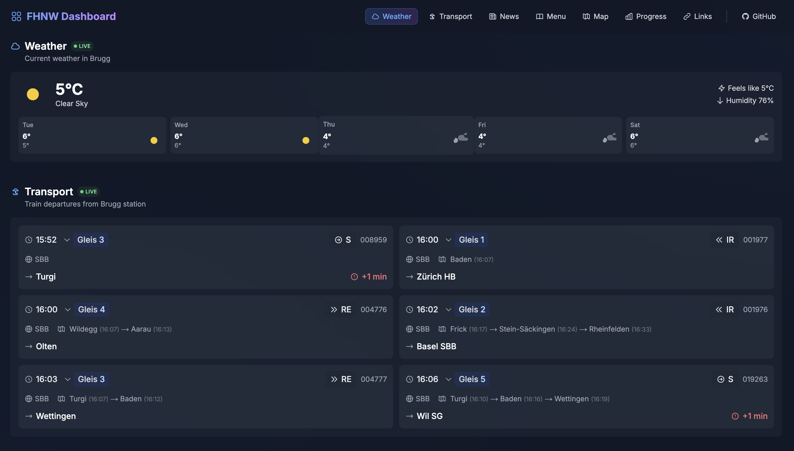

# FHNW Student Dashboard

> A modern, unified dashboard for FHNW students. Access all your essential resources in one place.

[](https://github.com/peaktwilight/fhnw-dashboard/releases)
[](https://fhnw.doruk.ch)
[](LICENSE)

**[Live Demo →](https://fhnw.doruk.ch)**



## Overview

FHNW Dashboard is an unofficial student-built web application that consolidates essential FHNW resources and real-time campus information into a single, responsive interface. Built with modern web technologies, it provides quick access to academic tools, live campus updates, and comprehensive navigation for FHNW students.

## Features

### Live Information
- **Weather Updates**: Real-time weather data for Brugg campus via OpenWeather API
- **Train Departures**: Live departure board for Brugg station
- **Mensa Menu**: Daily menu with dietary information
- **News Feed**: Latest FHNW announcements and updates

### Academic Tools
- **Grade Analytics**: Visual grade distribution and performance tracking
- **Module Management**: Track module registrations and study progress
- **Module Overview**: Comprehensive view of all registered modules
- **Registration Tracking**: Monitor ESP registration status

### User Experience
- **Smart Navigation**: Intelligent navbar with section tracking using Intersection Observer
- **Smooth Animations**: Polished page transitions and scroll animations via Framer Motion
- **Theme Support**: Light, dark, and system theme modes with persistent preferences
- **Internationalization**: Full support for English and German languages
- **Responsive Design**: Mobile-first approach optimized for all screen sizes
- **Interactive Maps**: Campus location visualization with React Leaflet

### Quick Access Hub
- One-click access to all FHNW platforms
- Organized resource categories
- Direct links to StudentHub, Moodle, Modulplaner, and more

## Tech Stack

### Core Framework
- **Next.js 15.1** - React framework with App Router and server-side rendering
- **React 19** - Latest React with concurrent features
- **TypeScript** - Type-safe development

### Styling & UI
- **Tailwind CSS 3.4** - Utility-first CSS framework
- **Framer Motion 12** - Production-ready animation library
- **Headless UI 2.2** - Unstyled, accessible UI components
- **Heroicons 2.2** - Beautiful hand-crafted SVG icons

### Features & Libraries
- **next-intl 3.26** - Type-safe internationalization
- **React Leaflet 5.0** - Interactive maps
- **date-fns 4.1** - Modern date utility library
- **Cheerio 1.0** - Server-side HTML parsing

### Development
- **Turbopack** - Next-gen bundler for fast development
- **ESLint** - Code quality and consistency
- **PostCSS & Autoprefixer** - CSS processing

## Getting Started

### Prerequisites
- Node.js 20+
- npm or yarn package manager

### Installation

```bash
# Clone the repository
git clone https://github.com/yourusername/fhnw-dashboard.git
cd fhnw-dashboard

# Install dependencies
npm install

# Set up environment variables
# Create a .env.local file (see Environment Variables section)
```

### Development

```bash
# Start development server with Turbopack
npm run dev
```

Visit `http://localhost:3004` to see your local version.

### Building for Production

```bash
# Create optimized production build
npm run build

# Start production server
npm run start
```

### Code Quality

```bash
# Run ESLint
npm run lint
```

## Environment Variables

Create a `.env.local` file in the root directory with the following variables:

```env
# Required: OpenWeather API key for weather data
OPENWEATHER_API_KEY=your_api_key_here

# Optional: Vercel deployment variables (auto-populated on Vercel)
NEXT_PUBLIC_VERCEL_GIT_COMMIT_SHA=
NEXT_PUBLIC_VERCEL_GIT_COMMIT_MESSAGE=
NEXT_PUBLIC_VERCEL_ENV=
NEXT_PUBLIC_BUILD_TIME=
```

**Note**: Get your free OpenWeather API key at [openweathermap.org/api](https://openweathermap.org/api).

## Project Structure

```
fhnw-dashboard/
├── app/
│   ├── [locale]/          # Localized routes (en/de)
│   │   ├── about/         # About page
│   │   ├── campus/        # Campus information page
│   │   ├── grades/        # Grade analytics page
│   │   ├── news/          # News page
│   │   ├── settings/      # Settings page
│   │   ├── layout.tsx     # Root layout with providers
│   │   └── page.tsx       # Home page
│   ├── api/               # API routes
│   │   ├── anmeldung/     # Registration data endpoint
│   │   ├── fhnw/          # FHNW data endpoints
│   │   ├── menu/          # Mensa menu endpoint
│   │   ├── news/          # News feed endpoint
│   │   └── weather/       # Weather data endpoint
│   ├── components/        # React components
│   │   ├── providers/     # Context providers
│   │   ├── settings/      # Settings components
│   │   └── [widgets]      # Feature components
│   ├── services/          # Data fetching services
│   ├── types/             # TypeScript type definitions
│   └── utils/             # Utility functions
├── i18n/                  # Internationalization config
├── messages/              # Translation files (en/de)
├── public/                # Static assets
│   ├── images/            # Image assets
│   └── static/            # Other static files
├── middleware.ts          # Next.js middleware for i18n
├── next.config.mjs        # Next.js configuration
└── tailwind.config.ts     # Tailwind CSS configuration
```

## Key Architecture Decisions

### Internationalization
- Uses `next-intl` for type-safe translations
- Locale-based routing (`/en/*` and `/de/*`)
- Automatic locale detection and switching
- Translations stored in JSON files per locale

### Data Fetching
- Server Components for initial data loading
- API routes for dynamic data (weather, news, menu)
- Dual-layer caching for weather data:
  - Server-side cache (10-minute TTL)
  - Client-side cache via Cache-Control headers
- Error boundaries and loading states

### Performance Optimizations
- Image optimization via Next.js Image component
- DNS prefetching for external resources
- Strict security headers (HSTS, CSP, etc.)
- Static asset caching with stale-while-revalidate
- Turbopack for faster development builds

### Theming
- System, light, and dark theme support
- Theme persistence via localStorage
- Automatic system theme detection
- Smooth theme transitions

## Deployment

This application is deployed on Vercel with automatic deployments from the main branch.

### Deploy Your Own

[](https://vercel.com/new/clone?repository-url=https://github.com/yourusername/fhnw-dashboard)

1. Click the Deploy button above
2. Configure environment variables
3. Deploy

## Available Resources

The dashboard provides quick access to:

- FHNW Homepage
- StudentHub
- Modulplaner
- Auxilium Timetable
- Grades Portal
- Moodle
- Room Reservation System
- ESP Registration
- And more...

## Contributing

Contributions are welcome! Whether it's bug fixes, new features, documentation improvements, or UI/UX enhancements.

### How to Contribute

1. Fork the repository
2. Create your feature branch (`git checkout -b feature/amazing-feature`)
3. Commit your changes (`git commit -m 'Add some amazing feature'`)
4. Push to the branch (`git push origin feature/amazing-feature`)
5. Open a Pull Request

## Recent Updates

### v1.2.1
- Improved weather data caching with dual-layer strategy
- Enhanced performance and reliability

### v1.2.0
- Enhanced SEO with structured data and metadata
- Improved page transitions and animations
- Robust internationalization implementation
- Fixed date handling with proper locale support

### v1.1
- Added FHNW news section
- Enhanced navbar with smart section tracking
- Improved grade analytics visualization

## Author

Created by [Doruk Tan Ozturk](https://doruk.ch)

## Disclaimer

This is an unofficial student project and is not affiliated with or endorsed by FHNW. Made by a student, for students.

## License

This project is licensed under the MIT License.
